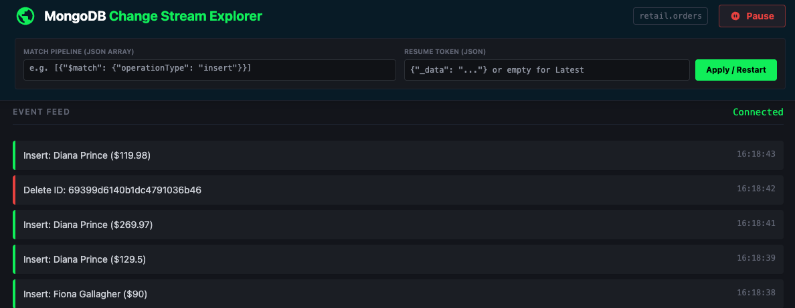

# MongoDB Change Stream Explorer 🍃

A lightweight, real-time visualization tool designed to demonstrate the power of **MongoDB Change Streams**.

This single-file application connects to a MongoDB database, watches for changes (Inserts, Updates, Deletes), and pushes them instantly to a web interface using WebSockets. It is designed as an educational sandbox to experiment with **Resume Tokens** and **Aggregation Pipelines**.



## 🚀 Prerequisites

1.  **Node.js** installed.
2.  **MongoDB Instance** running as a **Replica Set**.
      * *Note: Change Streams do not work on standalone MongoDB instances.*
      * *Atlas Users:* Free tier clusters work out of the box.
      * *Local Users:* Ensure you started mongod with `--replSet rs0` or use the Docker command below.

## 🛠️ Installation & Setup

1.  **Initialize the project:**

    ```bash
    npm init -y
    npm install express socket.io mongodb
    ```

2.  **Add the scripts:**

      * Save the application code as `server.js`.
      * Save the load generator code as `populate.js`.

3.  **Start a Local MongoDB (if needed):**
    If you don't have a database, run this Docker command to start a simple 1-node Replica Set:

    ```bash
    docker run --name mongo-repl -d -p 27017:27017 mongo:latest mongod --replSet rs0 --bind_ip_all
    # Initialize the set
    docker exec -it mongo-repl mongosh --eval "rs.initiate()"
    ```

## 🚦 How to Run

You will need **two** terminal windows.

**Terminal 1: The Monitor (Web Server)**

```bash
node server.js
```

  * Open your browser to `http://localhost:3000` (or other value if you changed the `PORT`)

**Terminal 2: The Load Generator**

```bash
node populate.js
```

  * This simulates a retail store, generating orders, updating statuses, and processing cancellations.

-----

## 🎓 Educational Scenarios

Here are three specific demos you can run to showcase the capabilities of Change Streams.

### Demo 1: The "Real-Time" Experience (Raw Events)

**Goal:** Show how applications can react instantly to database changes without polling.

1.  Start both scripts.
2.  Observe the UI. Note the color coding:
      * **Green (Insert):** New orders being placed.
      * **Yellow (Update):** Order status changing (e.g., to "Shipped"). *Note: We use `updateLookup`, so you see the full document, not just the changed fields.*
      * **Red (Delete):** Orders being cancelled.
3.  Click the arrow on any card to expand it and view the **Raw JSON Payload**. This is the actual change event document sent by MongoDB.

### Demo 2: Resilience with Resume Tokens

**Goal:** Demonstrate how to survive application crashes without missing data.

1.  Let the stream run for a moment.
2.  Click the **Pause** button in the top right.
3.  An overlay will appear. **Copy the Resume Token** provided.
4.  **Refresh your browser page.** The list is now empty (simulating an app restart/crash).
5.  Paste the token into the **"Resume Token"** input box at the top.
6.  Click **Apply / Restart**.
7.  **Result:** The stream will immediately replay the events that occurred *after* you paused, ensuring zero data loss, before catching up to live events.
8. In real-life you'd want to persist this resume token somewhere, not just show it in a browser.

### Demo 3: Server-Side Filtering

**Goal:** Show how to filter noise at the database level using Aggregation Pipelines.

By default, change streams send *everything*. In a high-traffic system, this is inefficient. You can filter events before they ever leave the database.

Paste the following JSON snippets into the **"Match Pipeline"** box and click **Apply**:

**A. Only Show New Orders (Inserts Only)**
Filter out updates and deletes to focus on growth.

```json
[{"$match": {"operationType": "insert"}}]
```

**B. High Value Orders**
Only notify the app if an order total is greater than $100.

```json
[{"$match": {"fullDocument.total": {"$gt": 100}}}]
```

**C. Watch a Specific Customer**
Imagine a "My Orders" page that only updates for a specifc user.

```json
[{"$match": {"fullDocument.customer": "Alice Smith"}}]
```

-----

## 🧰 Technical Notes

  * **`updateLookup`**: The script uses `{ fullDocument: 'updateLookup' }`. Without this, `update` operations would only show the *delta* (what changed), not the *context* (who the customer is).
  * **Socket.io**: Used to bridge the gap between the backend (which holds the TCP connection to MongoDB) and the frontend browser.
  * **The Pipeline**: The filters you type into the UI are passed directly to `collection.watch(pipeline)`.

## ❓ Troubleshooting

  * **"MongoError: The $changeStream stage is only supported on replica sets"**
      * **Fix:** You are running a standalone MongoDB instance. Convert it to a Replica Set or use the Docker command provided in the Installation section.
  * **Events stop appearing:**
      * Check if `node populate.js` is still running.
      * Check if you have a "Match Pipeline" active that is too restrictive (e.g., filtering for a customer that hasn't bought anything recently). Clear the box and hit Apply.